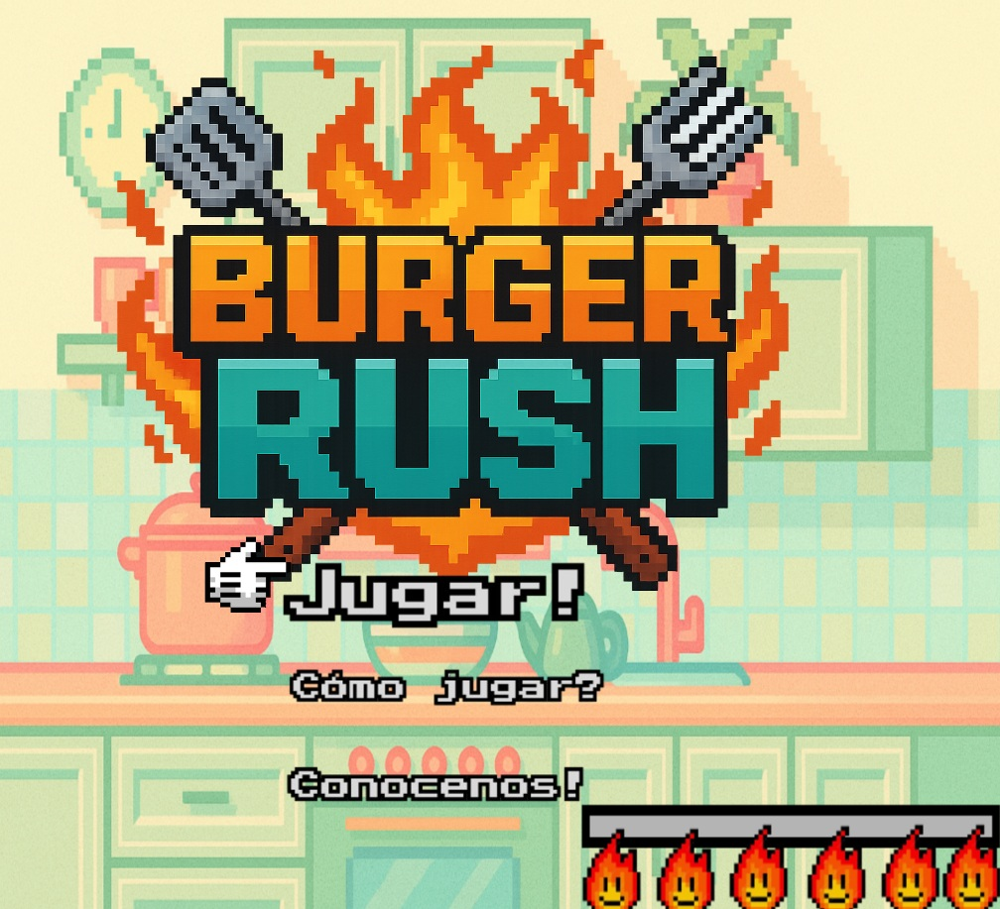
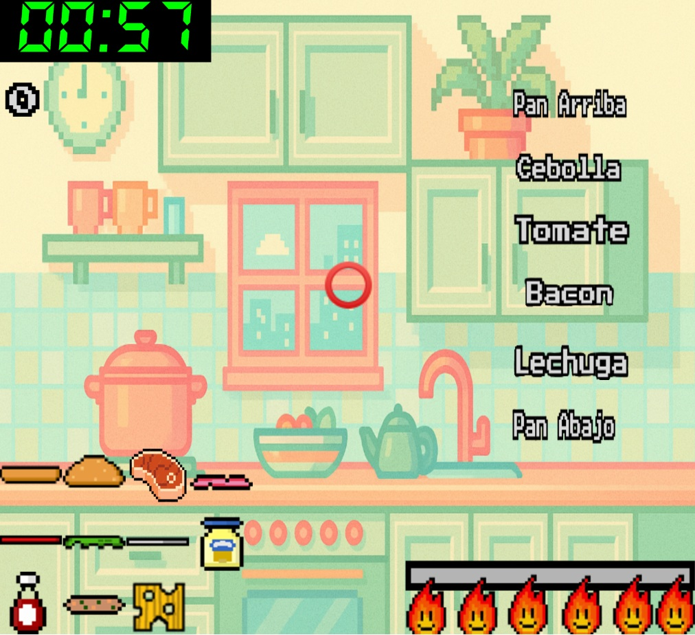
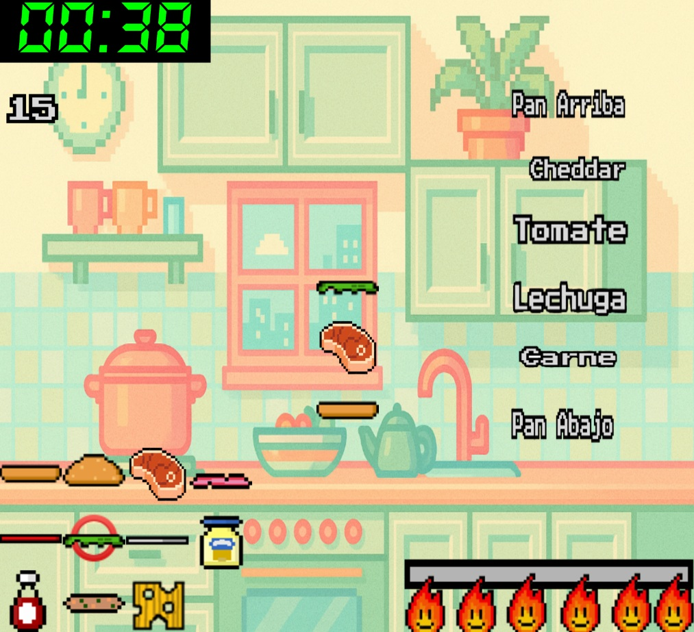

# Burger Rush

## Equipo de desarrollo

- Laura Belén Fernández.
- Nahuel Sebastian Neira.
- Ariel Agustin Oliva.
- Cristian Andres Vidal.

## Capturas

## Reglas de Juego

- Al comenzar la partida, aparecerá en pantalla un pedido aleatorio que deberás preparar.
- Ese pedido aparecerá en pantalla con los ingredientes que debe contener.
- Tu tarea es armar el pedido exactamente como se muestra, seleccionando, combinando y cocinando los ingredientes correctos.
- Si lo preparás correctamente, sumás puntos.
- Si te equivocás se te restan puntos.
- El objetivo final es alcanzar el puntaje ganador (60) antes de que se termine el tiempo total del juego.

## Controles

- W/S: Moverse por el menu.
- 🡡/🡣/🡠/🡢: Moverse en el juego.
- ENTER: Seleccionar una opción del menu / Indicar que el pedido está listo.
- M: Menu principal / Volumen al 0%.
- C: Sobre un alimento para cocinarlo.
- T: Sobre un alimento para seleccionarlo.
- B: Volumen al 100%.
- N: Volumen al 50%.

## Información adicional

- Universidad Nacional de Hurlingham.
- Versión de wollok: 0.3.1
- Una vez terminado, no tenemos problemas en que el repositorio sea público.